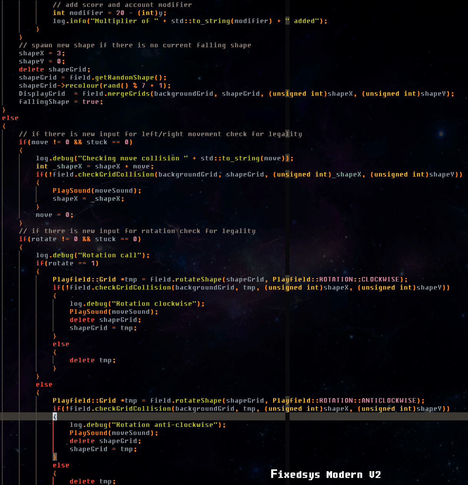
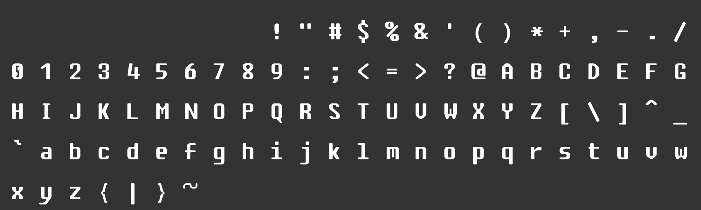
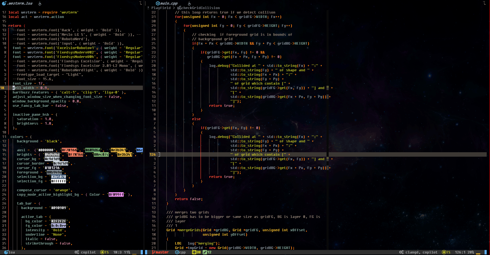

# About 
## Fixedsys Modern

A custom font by Delinx based on Fixedsys Excelsior

(the bottom is this version, top is the original)

(Horizontal character cell spacing is adjusted within WezTerm config, I prefer font to be narrow)

I love Fixedsys Excelsior, I used it for years, yet it does not scale nicely (obviously), I since then moved to RobotoMono but I still miss the look and feel from Fixedsys Excelsior.
This project is my attempt to re-create quirks of Fixedsys Excelsior and make it scale well. I have never designed fonts before, wish me luck.

[One of the threads describing cool things about Fixedsys](https://www.reddit.com/r/typography/comments/vuajeq/potential_scalable_version_of_fixedsys_and_how_i/)

Links:

[GitHub - kika/fixedsys: Fixedsys Excelsior font with programming ligatures](https://github.com/kika/fixedsys)

[clang-format configurator](https://zed0.co.uk/clang-format-configurator/) (C++ example code)

# TODO:

 * [X] Fix 's' char, it's weird heights when font is scaled
 * [X] Fix 'e' and 'd' upper bean thikness 
 * [ ] Make a NerdFont patched version of the font! (can fix horizontal spacing at the same time by hard limiting cell width)

# License

Do whatever original license allows you to do, I don't own original Fixedsys, nor Fixedsys Excelsior; so this is a modification for the original font, not a new font.
If you decide to credit me somwhere I appreciate it. 

# If you want to say thank you

